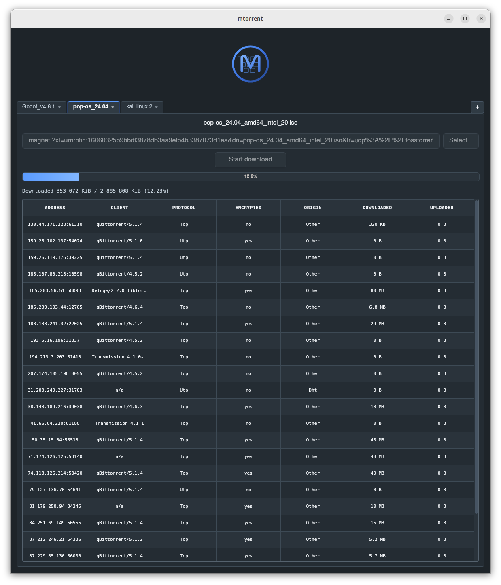

# mtorrent-gui

Simple graphical user interface for [mtorrent](https://github.com/DanglingPointer/mtorrent). Based on Tauri, tested on Ubuntu and Windows.

## Installation

Download latest pre-compiled binary for Windows or Debian-based Linux here: https://github.com/DanglingPointer/mtorrent-gui/releases/latest

## Environment variables

| Variable name | Description | Default value |
| --- | --- | --- |
| `MTORRENT_LOG` | Set the log level as described in the [`env_logger` documentation](https://docs.rs/env_logger/latest/env_logger/#enabling-logging). | `debug` |
| `MTORRENT_NET_IF` | Network interface to bind to, e.g. `eth0` or `en0`. If not set, the OS will choose the default interface. | (not set) |
| `MTORRENT_PWP_MODE` | Transport protocol for outbound peer connections. Possible values: `ANY` (try both TCP and uTP), `TCP_ONLY`, `UTP_ONLY`. | `ANY` |
